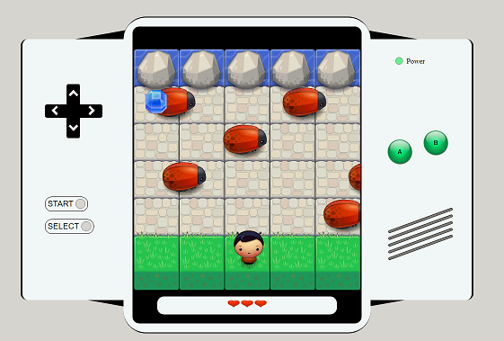

# Arcade Game

A fun javascript game where you want to collect gems as score and then try to get to the water with your character without getting hit by enemy bugs. Navigate by keyboard or touch/click.
Collect gems to get higher score. 
Works on some phone devices but not designed for that so can be weird then.

Ingame graphics and "game engine" by Udacity, sound effects from [OpenGameArt](https://opengameart.org/) and the rest coding by my self.

## Start guide:

### For local play:
1. Download game by pressing "clone and download".

2. Open up "index.html" in your browser (no need to modify anything).

3. Press the "play" button or space on your keyboard. Enjoy!

### For implement on your site:
1. Download zip file or use git and clone.

2. Two options..
   - Iframe the "index.html" file on your site.
   	 - or..
   - For code with everything:
     - copy all code inside the body tags and put it inside a div on your site. Remember that all files are needed.

## Play guide:
Collect gems (fast - time makes them less worth). After 4 gems the "master key" spawns on gameboard.
You want to collect the "master key" to get acces to the water.
Get to the water and you succes!
Under all time avoid the bugs/enemys to complete this.

Move the character with arrow keys or W,A,S,D.
Start the console with spacebar or by pressing the "start" button provided.
To change character or toggle sound on/off you can press the "select" button.

## License: 
Free for private use. For other idées please contact me first.